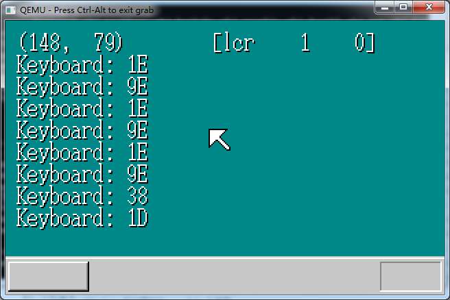

# SugarOS

SugarOS是我从零开始实现的基于80X86环境的操作系统。可以运行在Intel x86兼容机上。该系统仍在开发过程当中，不保证每一个Commit版本都可以被编译通过。

这个系统中很多思路都参考了川合秀实先生所著的书本《30天自制操作系统》，感谢川合秀实先生能够分享这样创造性的思路。而在这之上又融合了我个人的一些思考，重新构造了一些结构，确保能够更加简明高效。

源代码中的注释都尽量使用中文，希望能帮助大家理解（我不会告诉你是因为我不想查词汇表(￣▽￣)~*）；而由于CMD窗口实在不方便输入中文，每个Commit提交的备注均使用英文，望大家谅解！如果有需要把源码注释译成英文，可以在issue中提出，我会尽快的进行翻译。

放一张目前的截图：

# 开始使用

Windows环境下，运行!cons_nt.bat来启动Console，之后键入make run运行。

Makefile还提供如下指令：

- make asm，编译汇编
- make img，编译汇编，生成img映像
- make run，编译汇编，生成img映像，并运行
- make install，编译汇编，生成img映像，并刻录到U盘
- make clear，清除所有中间文件（除源代码，映像文件外所有文件）
- make pure，清除所有中间文件和映像文件（除源代码外所有文件）

Linux环境下，需要在应用仓库中安装QEMU和make，暂时还不支持使用nask和gcc魔改版进行编译。

# 关于开源协议

仓库中SugarOS本身，以及用于构造系统的汇编编译器nask，C编译器gcc，进行工具链生成的make，运行用模拟器QEMU等，均属于开源软件，遵守GNU通用公共许可证，即GNU GPL。

GNU GPL协议授予程序接受人以下权利，或称“自由”：

- 以任何目的运行此程序的自由；

- 再发行复制件的自由；

- 改进此程序，并公开发布改进的自由。

GNU GPL不会授予许可证接受人无限的权利。再发行权的授予需要许可证接受人开放软件的源代码，及所有修改。且复制件、修改版本，都必须以GPL为许可证，这是为了确保任何使用者不会独自占有开源软件。使用、复制或更改SugarOS的程序接受人视为同意GNU GPL协议，必须再次开源其更改后的派生物（如源代码等），否则将追究法律责任。

关于协议版本，SugarOS本身使用GPL v2协议，Tools文件夹中的开源软件可能使用GPL v2或GPL v3协议，版本视情况而定。

关于GPL v2协议，上述说明仅做参考，具体细节请以LICENSE为准，SugarOS原作者Jackie Lin(用户名lyj00912，<https://github.com/lyj00912> )保留一切解释权。

# 进度条

这里可以看到操作系统的完成进度：

2020/02/16  完成编译工具链的搭建，并使用汇编实现开机输出hello,world

2020/02/17  完成启动区编写，可以引导主程序进入内存

2020/02/18  完成主程序编写，并成功让启动区引导主程序运行，分离了引导区和输出程序的耦合

2020/03/30  完成256色视频模式调色板的编写，能够绘制彩色页面

2020/03/30  创建字体文件，成功输出字符串

2020/03/30  初始化GDT（全局段号记录表）和IDT（中断记录表）

2020/04/01  完成键盘控制

2020/04/02  完成鼠标控制

2020/04/02  重构控制台代码部分，使其更加解耦

2020/04/02  为所有代码添加注释

2020/04/06  完成内存检测

2020/04/06  实现内存管理